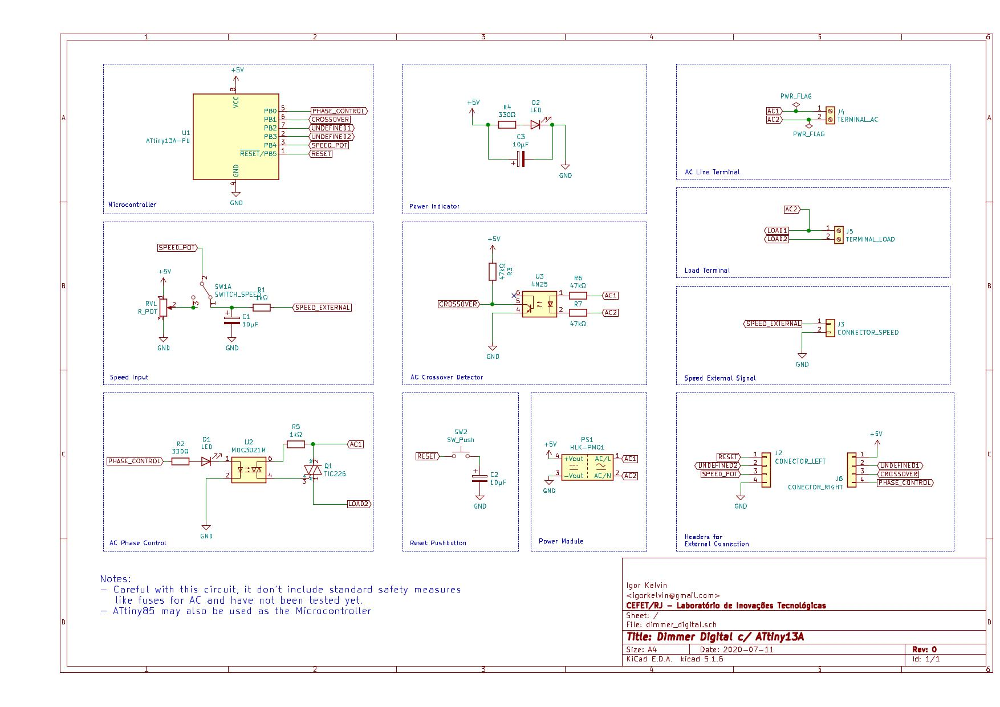

# Digital Dimmer with ATtiny13

## Description

A simple digital dimmer using a cheap 8-bits AVR ATtiny13, made for educational purposes.

It have been designed to be controlled by a potentiometer (connected externally via 2.54mm headers) or a analog or PWM 0-5V signal.

## Disclaimers

This circuit:

* handles AC voltage and may be dangerous;

* have not been tested yet;

* does not include fuse.
