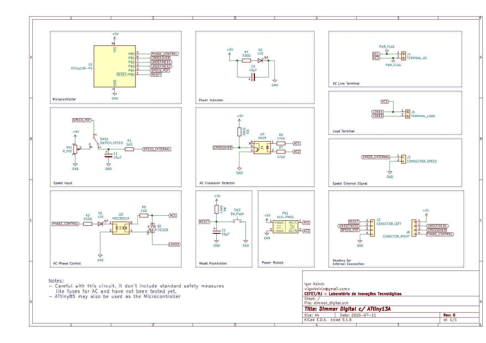
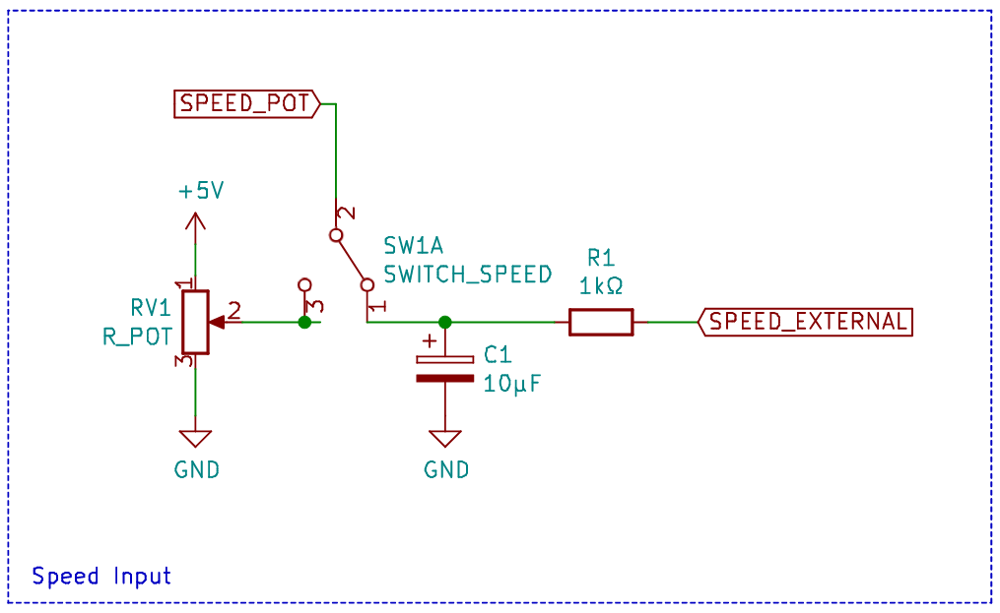

# Digital Dimmer with ATtiny13

## Description

A simple digital dimmer using a cheap 8-bits AVR ATtiny13, made for educational purposes.

It have been designed to be controlled by a potentiometer (externally connected via 2.54mm headers) or a analog or PWM 0-5V signal.

## Speed Input

The speed input signal source can be either from a potenciometer or a external 0-5V signal.

The source is selected by the SWITCH_SPEED (externally connected via 2.54mm headers).

The 0-5V signal is filted by a low-pass filter defined by R1 and C1.

## Disclaimers

This circuit:

* handles AC voltage and may be dangerous;

* have not been tested yet;

* does not include fuse.
